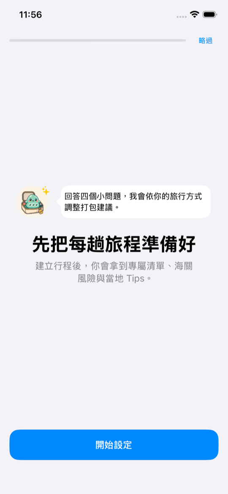
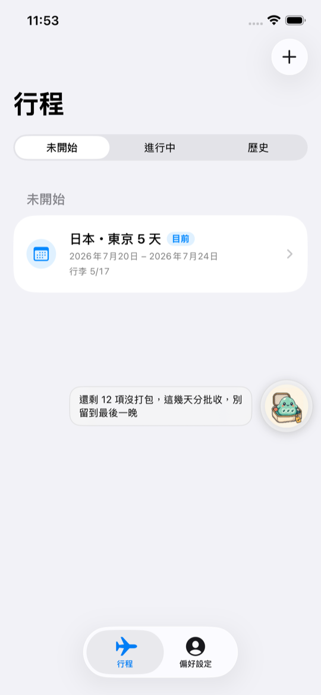
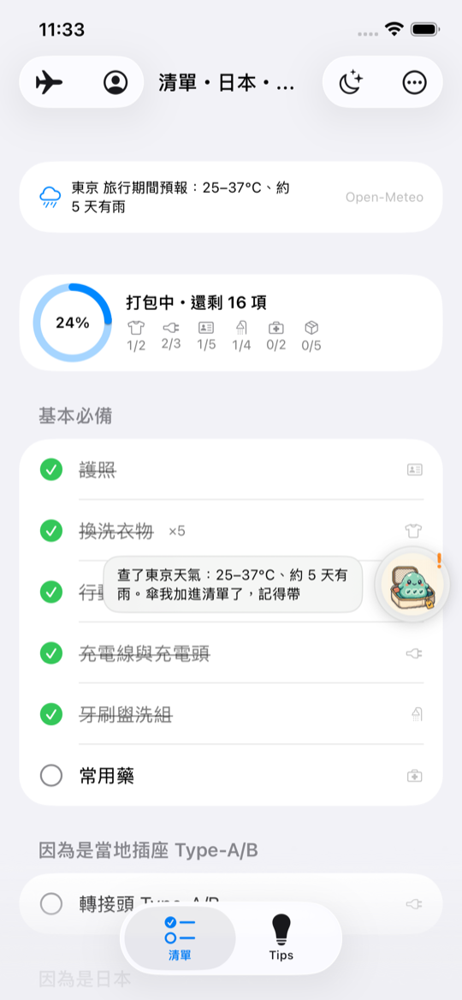
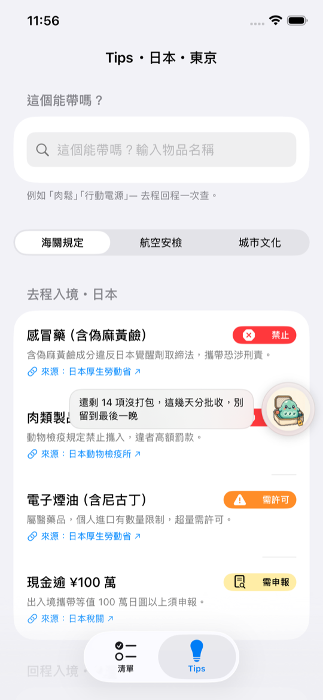

# TravelGenius 旅行天才

> **出國前，先看懂海關風險，再開始打包。**

聚焦兩件事的旅行助手 iOS App（SwiftUI + SwiftData，iOS 17+）：**行程 → 專屬打包清單＋當地 Tips**。繁體中文原生介面、資料留在裝置、零帳號，吉祥物**小史萊姆**全程陪跑。

## 亮點：「這個能帶嗎？」🟢

在 Tips 分頁輸入任何物品，小史萊姆**即問即答** — 同時查「去程入境海關」「回程入境海關」「航線安檢」三處規則，附官方來源與最後查證日期，完全離線：

- 「**肉鬆**」或「**肉絲**」→ 🚫 兩筆禁止：入境日本（動物檢疫所）＋回程入境台灣（防檢署，最高罰 100 萬）— **語意判定**，不是死板的關鍵字表
- 「**肉桂**」→ ✅ 查無限制（排除詞防誤判，有「肉」字不代表是肉品）
- 「**行動電源**」「充電寶」→ ✈️ 限隨身・禁托運（IATA Wh 分級；韓國航線加嚴規則依出發地/目的地自動出現）
- 「**電子菸**」→ 異體字（菸/煙）自動正規化命中

比對三層：口語別名 → 語意關鍵字＋排除詞 → 異體字正規化。**沒有任何打包 App 做物品層級的合法性問答。**

## UI Flow

```
首次啟動 ── 5 題偏好（年齡/性別/同行/經驗/行李偏好）
    ▼
階段一：底部分頁「行程＋偏好設定」──三步驟建行程（出發地/目的地/日期）
    ▼  建立或選定行程後自動切換
階段二：底部分頁「清單＋Tips」──打包與查規則（工具列可回行程管理）
    ▼  行程結束
自動退回階段一
```

## 操作步驟

### 1. 首次啟動：小史萊姆帶你回答五個問題



年齡層 → 性別（可略過）→ 同行組成 → 旅行經驗 → **行李偏好（輕便/完整）**。答案直接改變清單：家庭出遊多兒童用品、第一次出國多保命文件、輕便風格略過加分項目並減少衣物數量。

### 2. 行程：三步驟建立，分類管理



「未開始／進行中／歷史」分段檢視；「＋」進入三步驟建行程（出發地＋目的地，東亞台/日/韓含城市，自動帶預設城市）。建立後 App 切換為旅行模式。

### 3. 清單：先知道天氣，再開始打包



依「目的地規定＋文化＋**即時天氣**（Open-Meteo）＋**你的偏好**」生成，「因為是…」分組說明理由；預計有雨小史萊姆會自動加傘並跳出播報。工具列：前一晚模式、回程模式（防遺留，誤觸自動還原）、分享清單；左上可回行程管理與偏好設定。

### 4. Tips：能帶嗎＋雙向海關＋城市文化



頂部輸入框即問即答；海關規定分「去程入境」與「回程入境」兩段；城市文化提醒城市限定優先（東京手扶梯靠左、大阪靠右）。每條法規附官方來源連結。

### 小史萊姆 🟢

動畫吉祥物浮動於左右任一緣（拖曳吸附、位置記憶），點一下縮成半露、再點展開。D-day 行前提醒（D-1「行動電源充飽了嗎？」）、天氣播報、查詢回答，表情隨情境變化。

### 主畫面 Widget

「出發倒數」D-n＋打包進度（小／中尺寸），倒數以日期即時計算、跨日自動翻頁。

## 開發

- Xcode 26+，開啟 `TravelGenius.xcodeproj`，scheme `TravelGenius`，Cmd+R
- **Branch**：`main`＝聚焦版（本版）；`full-app`＝早期完整四模組版（含記帳、報帳匯出、醫療卡）
- CLI 建置：`DEVELOPER_DIR=/Applications/Xcode.app xcodebuild -project TravelGenius.xcodeproj -scheme TravelGenius -destination 'platform=iOS Simulator,name=iPhone 17' build`
- 開發用啟動引數：`-seedDemo`（示範行程）、`-resetOnboarding`、`-openPackTab` / `-openTipsTab`、`-checkItem 肉絲`（log 印出能帶嗎判定）、`-mascotDockOnLeft YES`
- 靜態資料在 `TravelGenius/Resources/SeedData/*.json` — 海關/安檢規則支援 `aliases`（口語別名）、`keywords`／`exclusions`（語意判定）與 `sourceUrl`，直接編輯即可擴充
- 設計系統：`TravelGenius/SharedUI/PackSmartDesignSystem.swift`＋`design-system/` 文件
- 實機安裝需在兩個 target 設定 Development Team 並註冊 App Group（`group.com.example.TravelGenius`）

## 資料來源

| 資料 | 來源 |
|---|---|
| 海關違禁品（日本） | [厚生勞動省](https://www.mhlw.go.jp/stf/seisakunitsuite/bunya/kenkou_iryou/iyakuhin/yunyu/)・[動物檢疫所](https://www.maff.go.jp/aqs/)・[日本稅關](https://www.customs.go.jp) |
| 海關違禁品（韓國） | [關稅廳](https://www.customs.go.kr)・[農林畜產檢疫本部](https://www.qia.go.kr) |
| 海關違禁品（台灣） | [財政部關務署](https://web.customs.gov.tw)・[動植物防疫檢疫署](https://www.aphia.gov.tw) |
| 航空安檢規則 | [交通部民用航空局](https://www.caa.gov.tw)・[IATA 鋰電池指引](https://www.iata.org/en/programs/cargo/dgr/lithium-batteries/)・[韓國國土交通部](https://www.molit.go.kr)（2025 行動電源新規） |
| 天氣預報 | [Open-Meteo](https://open-meteo.com)（免金鑰，僅目的地城市座標查詢，離線退回月份規則） |
| 文化提醒（罰則類） | 各地官方機構（京都市、台北捷運、海雲台區廳等，App 內附連結） |

> ⚠️ 法規可能變動，App 內顯示「最後查證日期」，出發前請點擊來源以最新公告為準。

## 架構

- SwiftData：`Trip`（出發地/目的地/日期）←`PackingItem`；偏好存 UserDefaults（`UserPreferences`，五欄位）
- 階段式導航：`RootTabView` 依「是否有進行中行程」切換分頁組；onboarding 完成後鎖定行程階段直到明確選定行程
- 規則引擎：`packing_rules.json` 多層（base/regulation/culture/weather/party/experience/age/gender＋fullOnly 輕便過濾），`PackingListGenerator.sync` 合併式重生成（永不動自訂與已打包項目）
- `CanIBringService`：別名／關鍵字＋排除詞／異體字三層比對 → 嚴重度排序，去程回程雙向
- `WeatherService`：Open-Meteo，6 小時快取，16 天預報範圍外自動退回
- 小史萊姆：`MascotState`（@Observable）＋`FloatingMascotDock`＋`AnimatedGIFView`（縮圖解碼、尊重減少動態）
