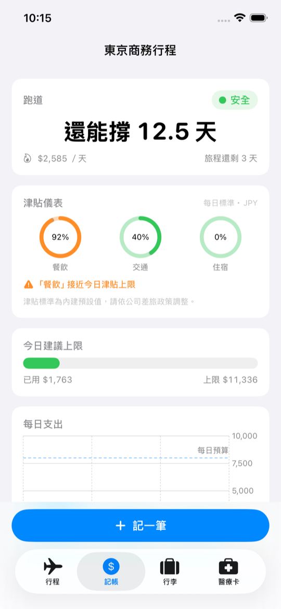
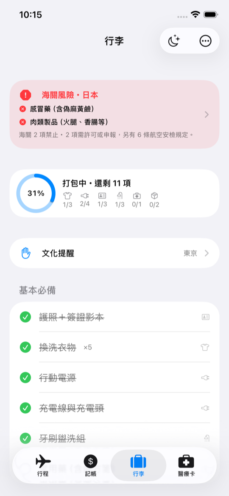
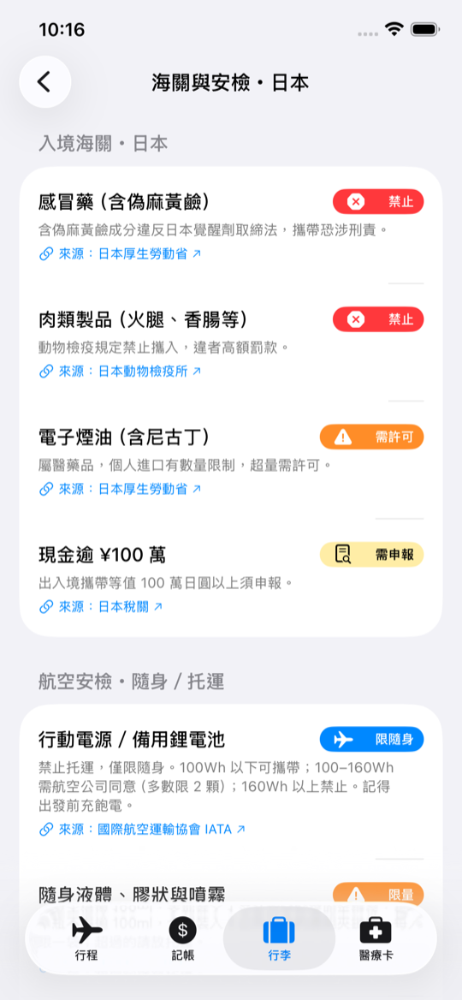
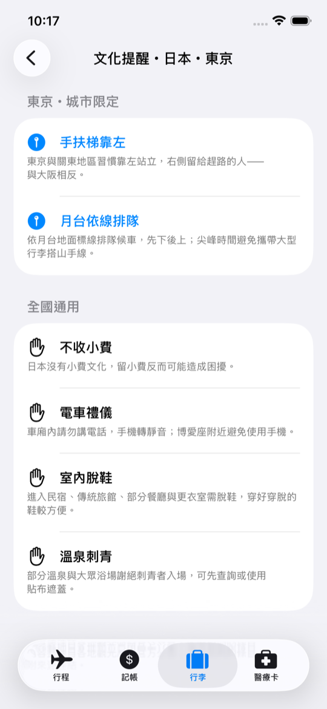
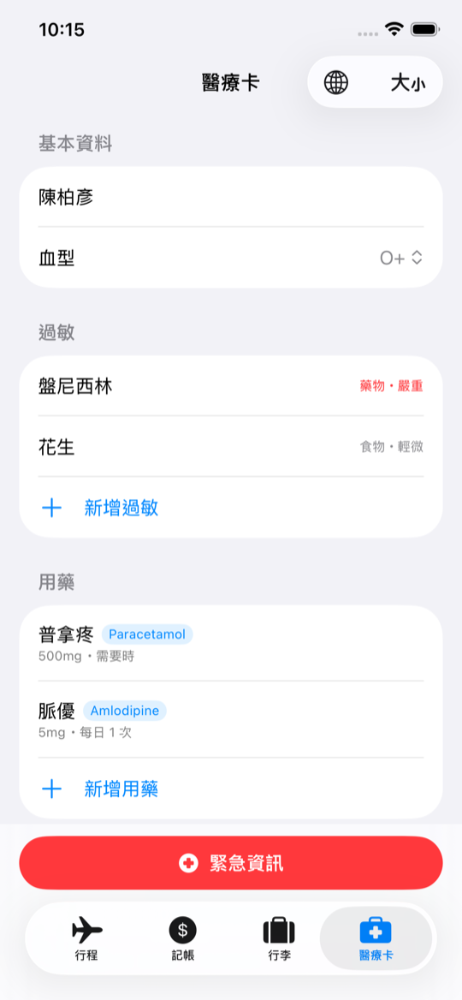
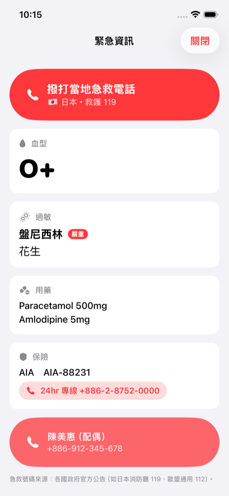
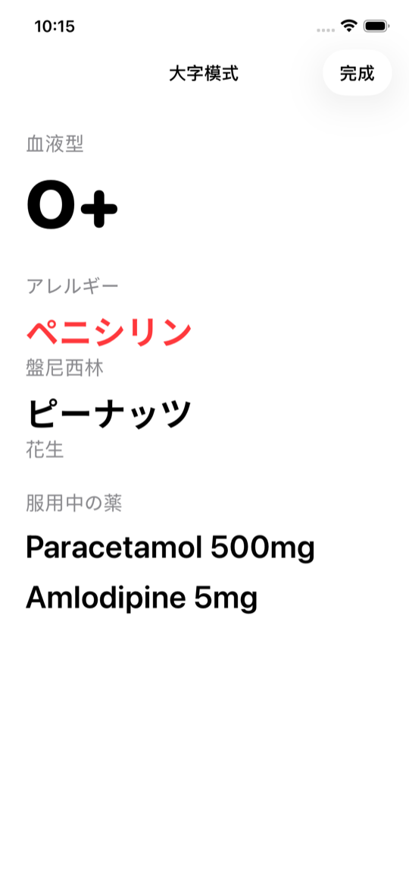

# TravelGenius 旅行天才

All-in-one 旅行助手 iOS App（SwiftUI + SwiftData，iOS 17+）。完全離線運作、資料留在裝置上、繁體中文原生介面。

## 四大模組

| 分頁 | 模組 | 核心功能 |
|---|---|---|
| 行程 | Trip | 行程管理、旅程回顧與下次預算建議 |
| 記帳 | Runway ＋ ExpenseSnap | 跑道倒數「還能撐幾天」、紅黃綠燈、兩步記帳、津貼儀表、收據照片、CSV/PDF 報帳匯出 |
| 行李 | PackSmart | 海關風險警示卡（禁止／需許可／需申報）＋航空安檢規則（液體限制、行動電源 Wh、韓國 2025 新規）、四層規則自動生成打包清單（因為是…分組）、城市限定文化提醒、前一晚模式、回程模式（反向打包防遺留） |
| 醫療卡 | MedCard | 藥名學名對照、六語離線翻譯卡、大字模式、緊急畫面（當地急救電話快撥） |

另含主畫面 Widget（旅費跑道，小＋中尺寸，App Group 資料共享）。

## 定位

> **PackSmart 讓你出國前一眼看懂海關風險，再拿到專屬打包清單。**

先查海關風險，再打包 — 與一般打包 App 的根本差異。

## 操作步驟

### 1. 首次啟動：30 秒問卷式 onboarding

首次開啟依序回答：旅行型態 → 出國最煩的事（複選）→ 目的地與日期。App 會即時比對海關與安檢規則、產生專屬打包清單，最後一頁可直接把清單分享給同行的人。已有資料的用戶自動跳過。

### 2. 行程：一切的起點

「＋」新增行程 — 只需目的地（＋城市）與日期，名稱可自動命名、預算可留空。記帳、行李、文化提醒都掛在「目前行程」之下，多行程可隨時切換；結束行程會產生旅程回顧與下次預算建議。

### 3. 記帳：還能撐幾天，一個數字

底部「記一筆」兩步完成：輸入金額（本幣/當地幣切換、自動折算）→ 點類別即儲存。儀表板顯示跑道倒數、紅黃綠燈、今日建議上限；商務行程額外顯示津貼儀表（80% 轉橘警示）。「匯出報帳」一鍵產出 CSV＋PDF（含收據附檔頁）。

### 4. 行李：先看風險，再打包

紅色「海關風險」卡永遠置頂，點入可見海關違禁品（三級嚴重度）＋航空安檢規則（行動電源 Wh、液體限量…），每條附官方來源連結與查證日期。「產生清單」依四層規則客製，項目以「因為是…」分組。工具列提供前一晚模式（大字掃未打包）、回程模式（反向檢查防遺留）、分享清單。

### 5. 文化提醒：城市層級

同國不同城市習慣可能相反（東京手扶梯靠左、大阪靠右）— 指定城市後，城市限定提醒置頂顯示，涉及罰則的條目附官方來源。

### 6. 醫療卡：緊急時刻的一頁

建檔血型／過敏／用藥（商品名自動對照國際學名：普拿疼 → Paracetamol）。「翻譯卡片」依行程目的地自動切換語言（六語離線語言包）；「大字模式」隔著櫃檯出示；紅色「緊急資訊」一頁集中當地急救電話快撥、血型、過敏與保險專線。

### 7. 主畫面 Widget

長按主畫面 → ＋ → 搜尋 TravelGenius 加入「旅費跑道」小工具：不開 App 就能看到還能撐幾天、狀態燈與今日上限（小／中兩種尺寸）。

## 開發

- Xcode 26+，開啟 `TravelGenius.xcodeproj`，scheme `TravelGenius`，Cmd+R
- CLI 建置：`DEVELOPER_DIR=/Applications/Xcode.app xcodebuild -project TravelGenius.xcodeproj -scheme TravelGenius -destination 'platform=iOS Simulator,name=iPhone 17' build`
- 開發用啟動引數：`-seedDemo`（載入東京商務行程示範資料）、`-openMoneyTab` / `-openPackTab` / `-openMedTab`、`-showEmergency` / `-showLargePrint` / `-showEtiquette`、`-exportDemo`
- 靜態資料（國家、匯率、津貼標準、打包規則、違禁品、文化提醒、藥名對照、醫療翻譯）都在 `TravelGenius/Resources/SeedData/*.json`，直接編輯即可擴充
- 實機安裝需在兩個 target 設定你的 Development Team，並註冊 App Group（`group.com.example.TravelGenius`）

## 資料來源

違禁品每一條目均於 App 內附官方來源連結與最後查證日期（`prohibited_items.json` 的 `sourceName` / `sourceUrl` / `lastVerified` 欄位）：

| 資料 | 來源 |
|---|---|
| 海關違禁品（日本） | [厚生勞動省](https://www.mhlw.go.jp/stf/seisakunitsuite/bunya/kenkou_iryou/iyakuhin/yunyu/)・[動物檢疫所](https://www.maff.go.jp/aqs/)・[日本稅關](https://www.customs.go.jp) |
| 海關違禁品（泰國） | [泰國海關](https://www.customs.go.th)・[泰國觀光局](https://www.tatnews.org)・[藝術廳](https://www.finearts.go.th) |
| 海關違禁品（新加坡） | [新加坡海關](https://www.customs.gov.sg)・[衛生科學局 HSA](https://www.hsa.gov.sg) |
| 海關違禁品（美國） | [美國海關暨邊境保護局 CBP](https://www.cbp.gov/travel/us-citizens/know-before-you-go/prohibited-and-restricted-items) |
| 海關違禁品（韓國） | [關稅廳](https://www.customs.go.kr)・[農林畜產檢疫本部](https://www.qia.go.kr) |
| 海關違禁品（英國） | [GOV.UK 食品](https://www.gov.uk/bringing-food-into-great-britain)・[GOV.UK 現金申報](https://www.gov.uk/bringing-cash-into-uk) |
| 海關違禁品（越南） | [越南海關](https://www.customs.gov.vn) |
| 海關違禁品（義大利／歐盟） | [義大利海關暨專賣總署](https://www.adm.gov.it)・[歐盟執委會](https://food.ec.europa.eu) |
| 海關違禁品（台灣） | [財政部關務署](https://web.customs.gov.tw)・[動植物防疫檢疫署](https://www.aphia.gov.tw) |
| 航空安檢規則 | [交通部民用航空局](https://www.caa.gov.tw)・[IATA 鋰電池指引](https://www.iata.org/en/programs/cargo/dgr/lithium-batteries/)・[韓國國土交通部](https://www.molit.go.kr)（2025 行動電源新規） |
| 匯率（離線快取） | [臺灣銀行牌告匯率](https://rate.bot.com.tw/xrt)，記帳當下凍結 |
| 文化提醒（罰則類） | 各地官方機構（京都市、威尼斯／羅馬市政府、NEA、NOAA、台北捷運等，App 內附連結） |
| 藥名學名對照 | WHO 國際非專利藥名（INN）、台灣食藥署藥品許可證資料庫 |
| 急救電話 | 各國政府官方公告 |
| 津貼標準 | App 內建預設值（UI 已標示），供使用者依公司政策調整 |

> ⚠️ 法規與匯率可能變動，App 內顯示「最後查證日期」，出發前請以官方最新公告為準。

## 架構

- SwiftData 模型：`Trip` ← `Expense`／`PackingItem`；`MedicalProfile`（獨立於行程）
- `Features/` 各模組互不引用，只共用 `Models/` 與 `Services/`
- Runway 與報帳共用同一筆 `Expense`（記一次帳、兩種視角）
- 匯率於記帳當下凍結（`rateToHome`），離線歷史不受日後匯率變動影響
