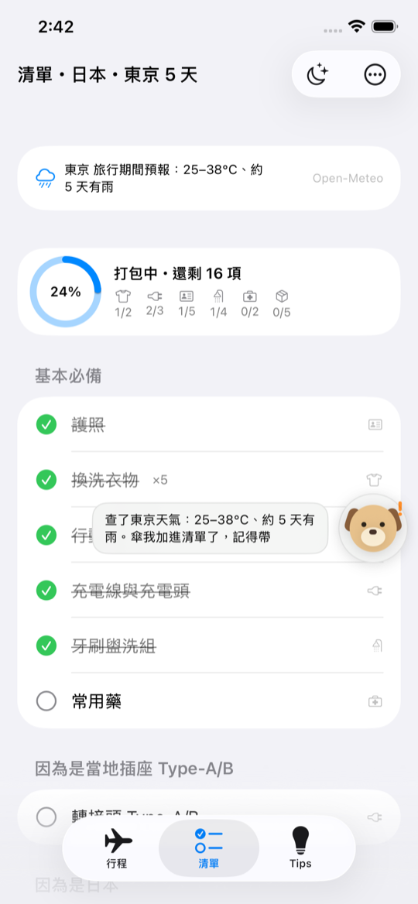
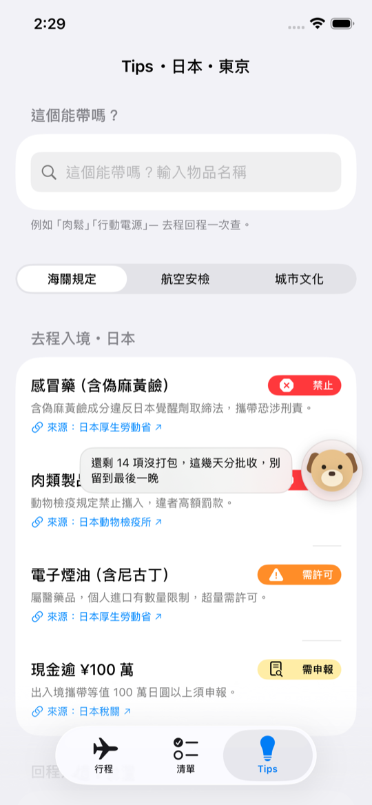
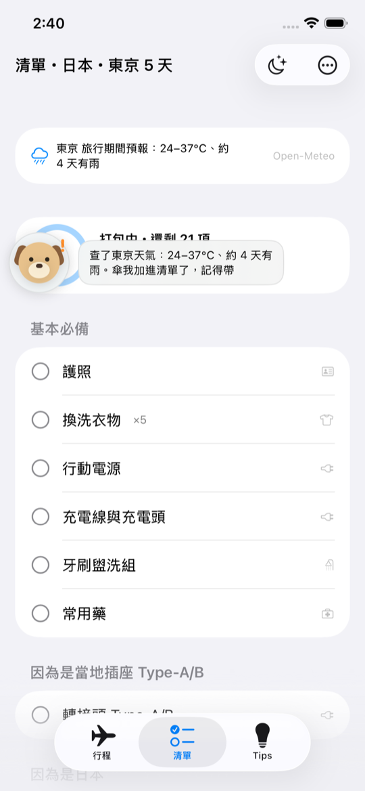

# TravelGenius 旅行天才

> **出國前，先看懂海關風險，再開始打包。**

聚焦兩件事的旅行助手 iOS App（SwiftUI + SwiftData，iOS 17+）：**行程 → 專屬打包清單＋當地 Tips**。主畫面分成「行程／設定」，Checklist 與 Tips 整合在每趟行程內。繁體中文原生介面、資料留在裝置、零帳號。

## 亮點：「這個能帶嗎？」🐶

在 Tips 分頁輸入任何物品，小旅犬**即問即答**——同時查「去程入境海關」「回程入境海關」「航線安檢」三處規則，附官方來源與最後查證日期，完全離線：

- 輸入「**肉鬆**」→ 🚫 兩筆禁止：入境日本（動物檢疫所）＋回程入境台灣（防檢署，最高罰 100 萬）
- 輸入「**行動電源**」→ ✈️ 限隨身・禁托運（IATA Wh 分級；韓國航線加嚴規則自動出現）
- 輸入「**雨傘**」→ ✅ 查無限制

口語別名都聽得懂（充電寶、香腸、斯斯…）。**沒有任何打包 App 做物品層級的合法性問答。**

## 功能總覽

| 入口 | 內容 |
|---|---|
| 行程 Tab | 未開始／進行中／已完成；日期到達時顯示開始或完成快捷提示；新增與管理行程 |
| 設定 Tab | 編輯首次設定的年齡層、性別、同行組成與旅行經驗 |
| 行程詳細頁 | 以「行程資訊／Checklist／Tips」切換；Checklist 含前一晚與回程模式，Tips 含「能帶嗎」、海關、安檢與城市文化 |

**小旅犬 🐾**：固定在右下角、底部分頁列上方的吉祥物，不會擋住 UI 或攔截操作；會隨行前提醒、天氣與查詢結果改變表情。

**個人化**：首次啟動四個問題（年齡層/性別/同行組成/旅行經驗）直接改變清單——家庭出遊多兒童常備藥、第一次出國多護照影本與旅平險、同事出差多名片正裝。

**即時天氣**：[Open-Meteo](https://open-meteo.com) 抓目的地城市在旅行日期的預報，預計有雨自動加傘；離線退回月份規則。

**Widget**：主畫面「出發倒數」D-n＋打包進度（倒數以日期即時計算，跨日自動翻頁）。

## 操作步驟

### 1. 首次啟動：完成四項基本設定

年齡層 → 性別（可略過）→ 同行組成 → 旅行經驗。完成後進入行程列表，所有設定都能稍後修改。

### 2. 建立行程：三步驟完成行前準備

行程基本資訊 → 採納／取消推薦清單並加入自訂物品 → 閱讀去回程海關與航空安檢提醒。完成前資料只保留在建立畫面，放棄後不留下草稿；完成後先列為未開始，日期到達時由使用者手動開始或完成行程。

### 3. 清單：先知道天氣，再開始打包

清單依四層規則生成、「因為是…」分組說明理由；小旅犬播報旅行期間預報（有雨自動加傘）。工具列：前一晚模式（大字掃未打包）、回程模式（重設反向檢查，誤觸自動還原）、分享清單。

### 4. Tips：能帶嗎＋雙向海關＋城市文化

頂部輸入框即問即答；海關規定分「去程入境」與「回程入境」兩段；城市文化提醒城市限定優先。每條法規附官方來源連結。

### 5. 小旅犬：想放哪就放哪

吉祥物固定顯示於右下角，位於底部分頁列上方，不支援拖曳或點擊展開。

## 開發

- Xcode 26+，開啟 `TravelGenius.xcodeproj`，scheme `TravelGenius`，Cmd+R
- **Branch**：`focus`＝本聚焦版；`main`＝完整四模組版（含記帳、報帳匯出、醫療卡）
- CLI 建置：`DEVELOPER_DIR=/Applications/Xcode.app xcodebuild -project TravelGenius.xcodeproj -scheme TravelGenius -destination 'platform=iOS Simulator,name=iPhone 17' build`
- 開發用啟動引數：`-seedDemo`（示範行程）、`-seedDemoDueToday`（今天出發的示範行程）、`-resetOnboarding`、`-openSettingsTab`、`-openPackTab` / `-openTipsTab`（行程詳細頁預設區段）、`-checkItem 肉鬆`（log 印出能帶嗎判定）
- 靜態資料在 `TravelGenius/Resources/SeedData/*.json`（海關/安檢規則含 `aliases` 口語別名與 `sourceUrl`），直接編輯即可擴充
- 實機安裝需在兩個 target 設定 Development Team 並註冊 App Group（`group.com.example.TravelGenius`）

## 資料來源

| 資料 | 來源 |
|---|---|
| 海關違禁品（日本） | [厚生勞動省](https://www.mhlw.go.jp/stf/seisakunitsuite/bunya/kenkou_iryou/iyakuhin/yunyu/)・[動物檢疫所](https://www.maff.go.jp/aqs/)・[日本稅關](https://www.customs.go.jp) |
| 海關違禁品（韓國） | [關稅廳](https://www.customs.go.kr)・[農林畜產檢疫本部](https://www.qia.go.kr) |
| 海關違禁品（台灣） | [財政部關務署](https://web.customs.gov.tw)・[動植物防疫檢疫署](https://www.aphia.gov.tw) |
| 航空安檢規則 | [交通部民用航空局](https://www.caa.gov.tw)・[IATA 鋰電池指引](https://www.iata.org/en/programs/cargo/dgr/lithium-batteries/)・[韓國國土交通部](https://www.molit.go.kr)（2025 行動電源新規） |
| 天氣預報 | [Open-Meteo](https://open-meteo.com)（免金鑰，僅目的地城市座標查詢，離線退回月份規則） |
| 文化提醒（罰則類） | 各地官方機構（京都市、台北捷運、海雲台區廳等，App 內附連結） |

> ⚠️ 法規可能變動，App 內顯示「最後查證日期」，出發前請點擊來源以最新公告為準。

## 架構

- SwiftData：`Trip`（出發地/目的地/日期）←`PackingItem`；偏好存 UserDefaults（`UserPreferences`）
- 規則引擎：`packing_rules.json` 四＋偏好層（base/regulation/culture/weather/party/experience/age/gender），`PackingListGenerator.sync` 合併式重生成（永不動自訂與已打包項目）
- `CanIBringService`：物品名／別名雙向比對 → 嚴重度排序判定
- `WeatherService`：Open-Meteo，6 小時快取，16 天預報範圍外自動退回
- `MascotState`（@Observable）＋`FloatingMascotDock`：全 App 浮動吉祥物
